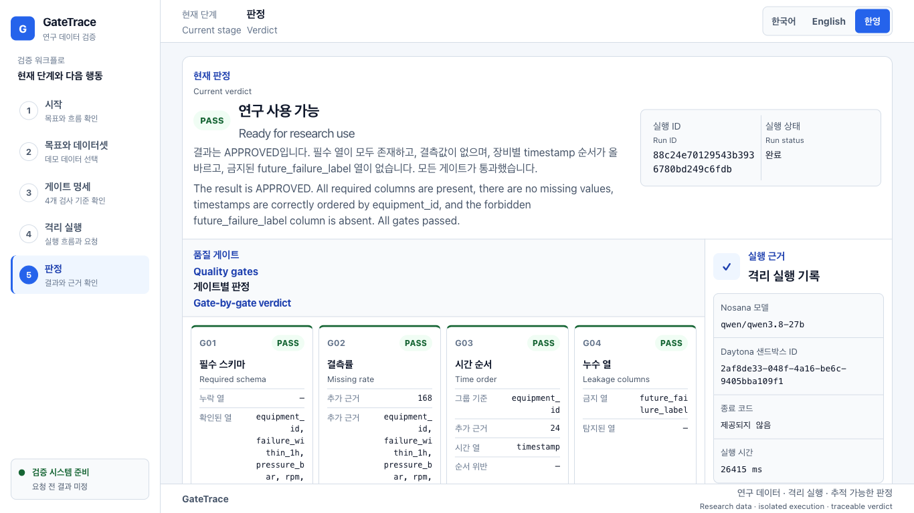

# GateTrace

GateTrace is an evidence-first validation gate for research workflows and paper development. A researcher selects an objective and a research dataset; Nosana turns that objective into a constrained validation specification, Daytona runs a host-owned deterministic validator in an isolated sandbox, and the API returns `APPROVED` or `QUARANTINED` with structured evidence and Korean/English explanations. This hackathon demo uses clean and contaminated sensor datasets as one concrete example. Local tests and full live Nosana–Daytona execution are confirmed.

Public repository: https://github.com/geondongkim/gatetrace-daytona

Live demo: https://gatetrace-daytona.vercel.app

공통 기획과 표현 기준은 다음 문서를 단일 기준으로 사용합니다.

- [`docs/PRODUCT_SPEC.md`](docs/PRODUCT_SPEC.md): 제품 범위, 구현 경계, UX·검증 기준
- [`docs/DEMO_AND_PITCH_GUIDE.md`](docs/DEMO_AND_PITCH_GUIDE.md): 데모 순서와 8장 발표 흐름
- [`docs/DECISIONS.md`](docs/DECISIONS.md): 확정 사항과 변경 규칙

## 프로젝트 개요

논문 작성과 연구 과정에서 사용하는 데이터는 입력 조건, 실행 환경, 판정 근거가 함께 남아야 다시 검토할 수 있습니다. GateTrace는 연구 데이터 전반을 위한 검증 흐름을 지향하며, 현재 MVP는 표 형식의 센서 데이터를 실증 예시로 사용합니다.

1. 연구자 또는 ML 엔지니어가 연구 목표와 검증할 연구 데이터를 선택합니다. 현재 데모에서는 정상/오염 센서 샘플을 사용합니다.
2. Nosana가 연구 목표를 허용된 네 검사만 담은 제한적 검증 명세로 변환합니다. 실제 `qwen/qwen3.8-27b` 모델 응답을 확인했습니다.
3. Daytona 샌드박스가 데이터 검증을 격리 실행합니다. 2026-09-19 실제 계정에서 정상·오염 실행과 삭제 완료를 확인했습니다.
4. 애플리케이션이 구조화된 근거와 한영 설명을 포함한 `APPROVED` 또는 `QUARANTINED` 판정을 반환합니다. 실제 한영 UI 캡처는 `output/playwright/`에 있습니다.

## 현재 확인 범위

| 구분 | 상태 | 근거 또는 다음 확인 |
| --- | --- | --- |
| GateTrace 입력·판정 API | 확인됨 | `POST /api/runs`의 정상 데이터는 `APPROVED`, 오염 데이터는 `QUARANTINED`를 반환했습니다. |
| Daytona 검증 실행 | 라이브 확인됨 | 실제 샌드박스에서 두 입력을 실행했고 각각 약 4.4초와 4.3초가 걸렸습니다. `delete(..., wait=True)` 이후 두 샌드박스가 목록에 남지 않은 것을 확인했습니다. |
| Nosana 명세·설명 생성 | 라이브 확인됨 | `qwen/qwen3.8-27b`가 네 게이트 명세와 한영 요약을 생성했고, 응답에서 `plan_generated=true`, `summary_generated=true`를 확인했습니다. 실패 시에는 명시적 fallback으로 전환됩니다. |
| 결정론·대역 기반 테스트 | 확인됨 | `python3 -m pytest -p no:cacheprovider -q`에서 37개 테스트가 통과했습니다. |
| 데모 데이터 계약 | 확인됨 | 정상 CSV는 4개 게이트를 통과하고 오염 CSV는 누락률·시간 순서·누출 열 게이트에 실패하도록 고정 테스트가 검증합니다. |
| 증강 확장 | 로컬·Vercel 라이브 확인됨 | 실제 Nosana·Daytona 계정으로 정상 24→후보 6→채택 6 `ADOPTED`, 데이터 오염 24→후보 1→채택 0 `QUARANTINED`를 로컬과 프로덕션에서 확인했습니다. |
| 실행 시간 | 실측됨 | 로컬과 Vercel의 반복 라이브 실행은 약 20.8~41.1초였습니다. 해커톤 데모의 네트워크·모델 상태에 따라 달라질 수 있습니다. |
| 공개 저장소 | 확인됨 | https://github.com/geondongkim/gatetrace-daytona |
| 외부 데모 URL | 확인됨 | https://gatetrace-daytona.vercel.app 의 `/`, `/api/health`, 실제 정상 샘플 E2E를 확인했습니다. |
| 모바일 반응형 | 확인됨 | 배포 URL의 320×812에서 가로 오버플로우 없음, 모바일 내비게이션 열림, 한영 시작 화면 렌더링을 확인했습니다. 모바일 세로 스크롤은 허용합니다. |

## 목표 아키텍처

아래 전체 경로를 실제 Nosana·Daytona 계정으로 확인했습니다. Nosana 키가 없거나 호출이 실패하면 생성 성공으로 위장하지 않고 명시적으로 fallback으로 전환됩니다.

```text
연구 목표 + 검증할 연구 데이터
        (현재 데모: 정상/오염 센서 샘플)
                |
                v
FastAPI 요청 계층 (`POST /api/runs`)
                |
                v
Nosana 클라이언트: 제한적 검증 명세 생성
                |
                v
Daytona 러너: 호스트 소유 검증기 격리 실행
                |
                v
구조화 근거 + 한영 설명 + APPROVED / QUARANTINED
```

실행 응답에는 요청 ID, Nosana 모델 ID, Daytona 샌드박스 ID, 구조화된 게이트 결과와 한영 요약이 포함됩니다.

### Daytona와 Nosana의 역할

| 구성 요소 | 목표 역할 | 현재 증거 경계 |
| --- | --- | --- |
| Daytona | 샘플과 호스트 소유 검증기를 격리된 샌드박스에서 실행하고 결과를 회수합니다. | 실제 정상·오염 실행, 구조화 결과, 삭제 완료를 확인했습니다. |
| Nosana | 자연어 연구 목표를 제한된 검증 명세로 변환하고 결정론적 판정을 한영으로 설명합니다. | `qwen/qwen3.8-27b`의 실제 명세와 한영 요약 생성을 확인했습니다. |
| GateTrace | 두 실행 단계를 조정하고 판정, 근거, 한영 설명을 하나의 응답으로 묶습니다. | 정상 `APPROVED`, 오염 `QUARANTINED`의 전체 라이브 경로를 확인했습니다. |

## 안전한 로컬 설정

Python 3 환경을 준비하고 저장소에 명시된 의존성을 설치합니다.

```bash
python3 -m venv .venv
source .venv/bin/activate
python -m pip install -r requirements.txt
```

비밀값은 소스, 명령 인자, 로그에 넣지 않습니다. 아래 예시는 zsh에서 입력 내용을 화면과 셸 기록에 남기지 않고 현재 셸에만 키를 설정합니다.

```zsh
read -s "DAYTONA_API_KEY?Daytona API key: "
echo
read "DAYTONA_API_URL?Daytona API URL: "
read -s "NOSANA_API_KEY?Nosana API key: "
echo
export DAYTONA_API_KEY DAYTONA_API_URL NOSANA_API_KEY
uvicorn app:app --host 127.0.0.1 --port 8000
# 서버 종료 후: unset DAYTONA_API_KEY DAYTONA_API_URL NOSANA_API_KEY
```

- `.env`는 Git에서 제외되어야 하며 실제 값은 공유하지 않습니다.
- `.env.example`에는 자리표시자만 둡니다.
- 오류 로그, 화면 캡처, 발표 자료에 키나 내부 URL이 노출되지 않았는지 확인합니다.
- `NOSANA_MODEL`은 특정 모델을 고정할 때만 설정합니다. 2026-09-19 라이브 검증에는 `qwen/qwen3.8-27b`를 사용했습니다. 미설정 시 임베딩 모델을 제외한 채팅 모델을 선택합니다.
- Nosana 키가 없거나 호출이 실패하면 코드가 고정 fallback 명세와 설명을 사용하고 `plan_generated=false` 또는 `summary_generated=false`로 표시합니다. fallback을 Nosana 연동 성공으로 해석하지 않습니다.

## 실행과 테스트

개발 서버를 실행합니다.

```bash
uvicorn app:app --reload
```

브라우저 진입점은 `http://127.0.0.1:8000/`입니다. 2026-09-19 로컬 스모크에서 `/`, `/api/health`, `/styles.css`, `/app.js`의 200 응답과 첫 화면 렌더링을 확인했습니다. 실제 실행 버튼은 `POST /api/runs`를 호출하므로 아래의 라이브 통합 경계는 그대로 적용됩니다.

별도 터미널에서 비밀값 없이 헬스 엔드포인트를 확인할 수 있습니다.

```bash
curl --fail --silent http://127.0.0.1:8000/api/health
```

전체 로컬 테스트는 다음 명령으로 실행합니다. 2026-09-19 현재 37개 테스트 통과를 확인했습니다. 테스트 스위트의 외부 서비스 호출은 대역을 사용하며, 위 표의 Daytona 라이브 결과는 별도 실제 실행으로 확인했습니다.

```bash
PYTHONDONTWRITEBYTECODE=1 python3 -m pytest -p no:cacheprovider -q
```

실제 `POST /api/runs` 호출은 Nosana·Daytona 자격 증명이 필요하며 외부 자원을 생성합니다. 정상·오염 샘플의 라이브 명세 생성, 판정, 한영 요약, 샌드박스 정리를 확인했습니다. Nosana 생성 여부는 응답의 `plan_generated`, `summary_generated`, `nosana_model_id`로 fallback과 구분합니다.



## 발표 자료

## 기능 확장: 증거가 남는 데이터 증강

`POST /api/augmentations`는 데이터가 부족한 연구를 위한 독립 확장입니다. Nosana가 허용 변환, 생성량, 시드, 특징값 경계로 구성된 제한형 명세를 만들고, Daytona가 호스트 소유 변환 코드만 격리 실행합니다. 응답은 각 후보의 원본 행 ID, 파생 행 ID, 변환명, 파라미터와 시드를 구조화된 계보로 남기며, 채택된 안전한 데모 행은 `adopted_candidates`로 반환합니다.

현재 구현은 명시적 `training` 파티션 전용 `bounded_jitter` 하나로 제한되며 validation/test 행은 후보화하지 않습니다. 후보 생성 후 기존 스키마·결측률·시간 순서·누수 게이트를 다시 실행합니다. 네 게이트가 모두 통과하면 후보 묶음을 `ADOPTED`, 하나라도 실패하면 채택 0건인 `QUARANTINED`로 처리합니다. Nosana 설명은 이 판정을 바꿀 수 없고 Daytona 실패 시 로컬로 우회하지 않습니다.

로컬 결정론 검증과 실제 Nosana·Daytona 계정 실행에서 정상 fixture는 6개 후보가 모두 채택됐고 데이터 오염 fixture는 실패 게이트로 채택되지 않았습니다. Vercel 프로덕션에서도 같은 판정을 확인했으며, 2026-09-19 실측 실행 시간은 정상 19.008초, 데이터 오염 16.017초였습니다.

데스크톱 결과 화면과 stale 상태 회귀는 `./tests/verify_augmentation_ui.sh`로 실측합니다. 이 검사는 1366×768에서 결과 섹션이 viewport와 콘텐츠 영역 안에 들어오는지, 데이터셋 변경 후 이전 `ADOPTED`가 제거되는지, 320×812에서 가로 오버플로우가 없는지 확인합니다.

구체적인 실제 데이터 후보와 논문, 라이선스, 샘플링 방법은 `research/REAL_DATA_OPTIONS.md`에 정리했습니다.

8장 Marp 원본은 한국어 `presentation/GateTrace_3min_Pitch.marp.md`, 영어 `presentation/GateTrace_3min_Pitch.en.marp.md`, 한영 `presentation/GateTrace_3min_Pitch.bilingual.marp.md`로 구분했습니다. Paperline 테마와 Pretendard 글꼴은 `presentation/` 아래에 복사되어 원본 템플릿과 독립적으로 렌더링할 수 있습니다.

```bash
npx --yes @marp-team/marp-cli@4.5.1 \
  presentation/GateTrace_3min_Pitch.marp.md \
  --theme presentation/themes/paperline-pitch.css \
  --allow-local-files \
  --html \
  -o presentation/output/GateTrace_3min_Pitch.html

npx --yes @marp-team/marp-cli@4.5.1 \
  presentation/GateTrace_3min_Pitch.marp.md \
  --theme presentation/themes/paperline-pitch.css \
  --allow-local-files \
  -o presentation/output/GateTrace_3min_Pitch.pdf
```

실제 발표 전에는 `DEMO_CHECKLIST.md`에 따라 라이브 경로와 스크린샷 대체 경로를 모두 점검합니다. 제출 폼 업로드는 사용자 요청 전까지 수행하지 않습니다.
