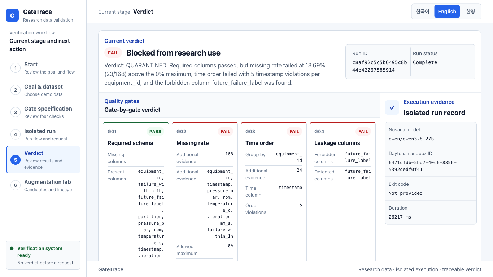

<!-- _class: cover -->

DAYTONA HACKSPRINT SEOUL · SOLO BUILD

<h1>GateTrace</h1>

Research inputs verified before use, with evidence preserved for every verdict

Geondong Kim

<!--
00:00-00:15
GateTrace validates inputs before they enter a research or paper-development workflow and preserves the evidence behind every verdict. Today I will demonstrate that flow with a sensor CSV.
-->

---

<!-- _class: problem -->

01 · RESEARCH PROBLEM

# Input errors propagate into research results

“

Contaminated inputs weaken analysis and training, while unexplained blocking discards valid evidence.

Researchers need to know what was checked and why an input was blocked before they use it.

<figure class="research-users-visual">

<figcaption>Example users · Experimental data · Survey data · Training data</figcaption>
</figure>

<!--
00:15-00:30
Unverified inputs can distort analysis and model training. Unexplained blocking also wastes valid material, slowing research while reducing trust in the process.
-->

---

<!-- _class: solution -->

02 · CURRENT LIMITATION

# Pass or fail alone is not enough for research

<b>01</b><strong>Check scope</strong>The applied rules are unclear

<b>02</b><strong>Run environment</strong>Inputs and verification code are mixed

<b>03</b><strong>Failure reason</strong>Evidence is scattered across tools

<b>04</b><strong>Reproducibility</strong>The same run is difficult to trace

A verdict must travel with its execution evidence.

<!--
00:30-00:45
Existing checks scatter rules, execution context, and failure evidence. When generated explanations are mixed with the verdict, it is also unclear which system made the decision.
-->

---

<!-- _class: solution -->

03 · GATETRACE SOLUTION

# Researchers only choose a goal and input

<b>01</b><strong>State the goal</strong>Describe the intended research use

<b>02</b><strong>Select a sample</strong>Demo: clean or contaminated sensor CSV

<b>03</b><strong>Run in isolation</strong>Evaluate constrained gates in Daytona

<b>04</b><strong>Review evidence</strong>Verdict, gate evidence, and trace keys

APPROVED or QUARANTINED, with the reason on one screen.

<!--
00:45-01:00
The researcher selects a goal and an input. GateTrace connects a constrained specification, isolated verification, and traceable evidence so the approval or quarantine reason is immediately visible.
-->

---

<!-- _class: demo -->

04 · LIVE SENSOR CSV DEMO

# A contaminated input is quarantined with evidence

A · INPUT

<h2>Contaminated sensor CSV</h2>

Tabular-data implementation example

B · VERDICT

<h2>QUARANTINED</h2>

Three of four gates failed

C · DAYTONA

<h2>26.217s</h2>

Sandbox ID and duration recorded

<!--
01:00-01:15
This implementation uses a sensor CSV. The contaminated sample failed three of four gates, and an actual Daytona run quarantined it with the sandbox ID and gate evidence preserved.
-->

---

<!-- _class: integration -->

05 · SPONSOR INTEGRATION AND SAFETY

# Generation is constrained; the verdict stays deterministic

<small>INPUT</small><strong>Research goal</strong>
<i>›</i>

<small>NOSANA</small><strong>Constrained specification</strong>
<i>›</i>

<small>DAYTONA</small><strong>Isolated audit</strong>
<i>›</i>

<small>VERDICT</small><strong>APPROVED QUARANTINED</strong>
<i>›</i>

<small>RECORD</small><strong>Evidence and trace keys</strong>

<b>Nosana</b> Maps the research goal to four allowed gates and explanations

<b>Daytona</b> Runs the host-owned verifier in isolation, returns results, and deletes the sandbox

<strong>SAFETY BOUNDARY</strong> Nosana cannot change Daytona's deterministic verdict.

<!--
01:15-01:30
Nosana produces only the constrained specification and explanation. Daytona runs the deterministic verifier, so a generated response cannot change APPROVED or QUARANTINED.
-->

---

<!-- _class: evidence -->

06 · VERIFIED RESULTS

# Live results and reproduction paths are public

LOCAL CONTRACT<strong>18 / 18 tests passed <small>external services mocked</small></strong>

DAYTONA LIVE<strong>Clean APPROVED 4/4 · contaminated QUARANTINED 1/4</strong>

VERCEL LIVE<strong>gatetrace-daytona.vercel.app</strong>

PUBLIC REPOSITORY<strong>github.com/geondongkim/gatetrace-daytona</strong>

Nosana live confirmed · qwen/qwen3.8-27b · Daytona clean/contaminated runs and sandbox deletion verified

<!--
01:30-01:45
Eighteen contract tests passed, and I verified clean and contaminated verdicts plus sandbox deletion. The live app and reproducible code are available on Vercel and GitHub.
-->

---

<!-- _class: impact -->

EXPECTED IMPACT

# A verifiable adoption gate for research inputs

<b>01</b><strong>Block contamination</strong>Quarantine failed inputs before analysis or training

<b>02</b><strong>Review every verdict</strong>Preserve the request, run, and gate evidence together

<b>03</b><strong>Extend adoption rules</strong>Apply the same gates to later datasets

<strong>NEXT STAGE</strong> Evidence-preserving augmentation · retain provenance and accept only generated samples that pass the gates

This is an expected impact and extension plan. Document inputs require a dedicated verifier.

<!--
01:45-02:00
GateTrace blocks contaminated inputs before use and keeps each verdict reviewable. The next stage applies the same gates to augmented data and accepts only candidates that pass.
-->
